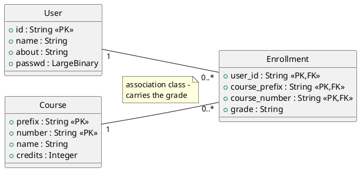
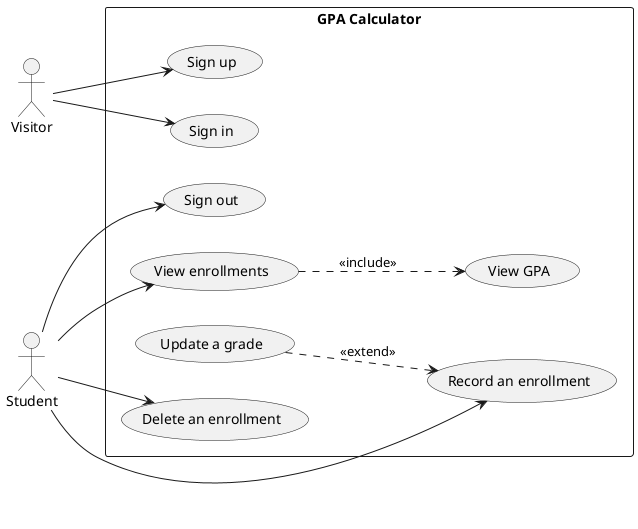

# /uml

Generate `uml/use_case.wsd` and `uml/class.wsd`. Worth 5 rubric points each, and both are presented at the checkpoint. Both ship as empty stubs.

Take which one as an argument (`/uml class`); with none, do both.

## Sources

- **Class diagram**: `src/app/models.py` is the truth, [data_model.md](../../../docs/design/data_model.md) is the explanation. Read the code - a diagram drawn from the doc alone drifts.
- **Use case diagram**: [use_cases.md](../../../docs/design/use_cases.md), cross-checked against the routes actually in `src/app/routes.py`.

## Class diagram

`uml/class.wsd` needs three classes with their attributes and types, both relationships with multiplicities, and `Enrollment` marked as the association class.



Points to get right: the **composite primary key** on `Course`, the composite FK from `Enrollment`, and the fact that `Enrollment` resolves a many-to-many because it carries an attribute. That last point is what the diagram is being graded for.

## Use case diagram

`uml/use_case.wsd` needs both actors, the eight use cases, a system boundary, and the two relationships.



`Student` inheriting from `Visitor` is a reasonable refinement if the team wants it. Keep `left to right direction` - the default layout is unreadable past four use cases.

## Render and commit

```
plantuml uml/class.wsd uml/use_case.wsd
```

Or the PlantUML extension in VS Code. **Commit the rendered PNGs beside the sources** - the instructor should not have to render them, and the checkpoint is presented from images.

## Keep them true

A diagram that disagrees with the code is worth less than one that is plainly incomplete. Re-run this after any `/new-model`, and check the use case diagram against `routes.py` before the checkpoint.
