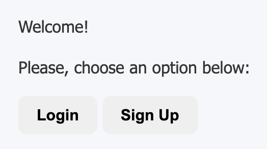
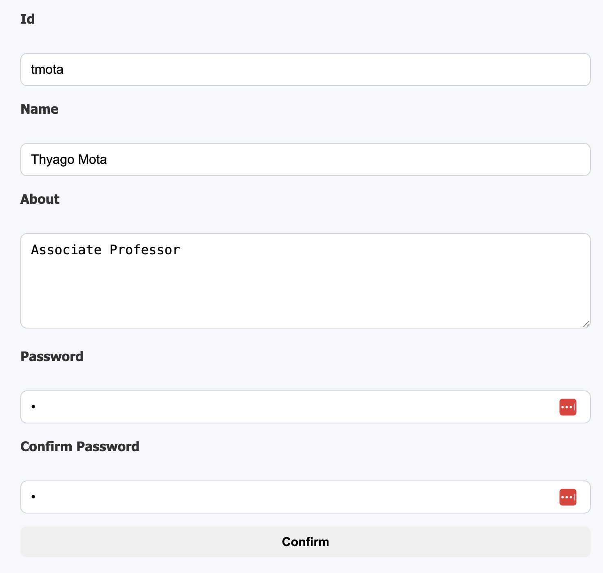
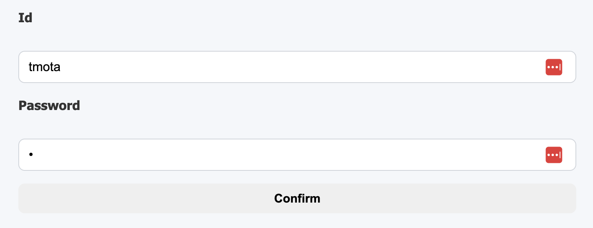
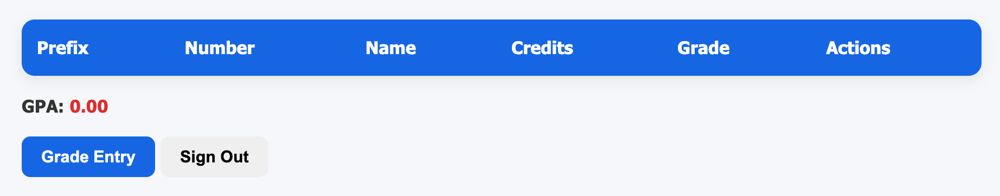
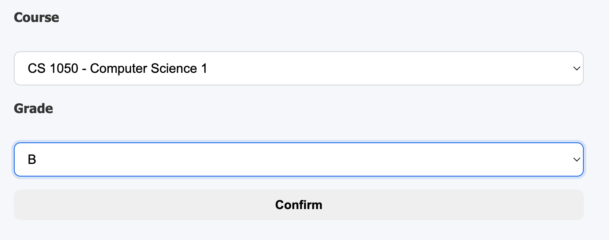
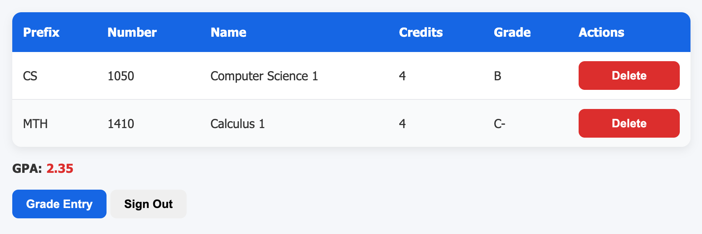
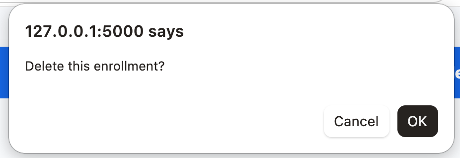

# Overview

Your team has been hired to develop a simple web application that allows students to track their GPAs. This project serves as an initial proof of concept to demonstrate your team's capabilities before it is assigned a more complex task. Because the project's requirements are well defined and its scope is limited, the team has chosen the Waterfall process model, following its traditional phases which include:

* Communication: gathering and understanding requirements
* Planning: defining schedules, resources, and milestones
* Modeling: designing system architecture and data models
* Construction: implementing and testing the application
* Deployment: delivering the final product to users

# Communication Phase

## Overview

The project involves developing a web application that allows students to track their GPAs. Students should be able to register for the application and, after successfully logging in, enter completed courses along with their corresponding letter grades. The application should display all previously entered courses and calculate the student's overall GPA. Students should also be able to update their letter grades if they were entered incorrectly.

## Objectives 

* Track previously completed courses for each student, including their letter grades.
* Calculate and display the student's overall GPA.

## Requirements 

1. Users must be able to authenticate themselves.
2. Students (authenticated users) must be able to view all previously completed courses.
3. Students must be able to view their current GPA.
4. Students must be able to update the letter grade for a course.
5. Students must be able to delete a previously completed course.

## Constraints 

* A working version of the web application is expected to be delivered in 3 weeks. 
* The implementation team is limited to 3 to 5 members. 
* The software must be implemented in Python, Flask, and SQLAlchemy. 

## Risks 

* The project team has limited experience with some of the technologies and tools being used.

# Planning Phase

## Schedule 

Estimate a schedule for this project by completing the table below. 

|Phase|Task|Start|End|Duration|Deliverable|
|---|---|---|---|---|---|
|Modeling|Requirements Analysis|09/22/26|09/26/26|4 days|Use Case Diagram|
|Modeling|Data Model|09/22/26|09/26/26|4 days|Class Diagram|
|Construction|Coding|09/25/26|09/30/26|5 days|Code|
|Construction|Testing|09/25/26|09/30/26|5 days|Test Report|
|Deployment|Delivery|10/01/26|10/03/26|2 days|Final Commit/Push|

## Team Roles

Assign roles to each team member by completing the table below. A member may take on more than one role.

|Name|Role(s)|
|--|--|
|Aden Lytle|manager,developer,tester,documenter|
|Johnny (Juan) De La garza | developer, tester|
|Isabella Eaton| tester, documenter|
|Elijah Damian-Ortiz| developer, tester|

# Modeling Phase

## Requirements Analysis 

Based on the project description, perform a requirements analysis by developing a UML use case diagram that captures the system's key functionalities and user interactions.

## Data Model 

Based on the data model defined in [src/models.py](src/models.py), create a UML class diagram to document the system's structure. The model includes the following entities:

* User: id, name, about, and password.
* Courses: prefix, number, name, credits
* Enrollment: user_id, course_prefix, course_number, grade

Make sure that your class diagram shows the association between **User**, **Course**, and **Enrollment**. 

## Baseline Implementation

A baseline for the web app is given in **Flask**. The project should be structured like the following: 

```
.venv
pics
src
|__app
|____ __init__.py
|____ modes.py
|____ routes.py
|____ forms.py
|__ init_db.py
instance
|__ prj1.db
static
|__ style.css
templates
|__ base.html
|__ index.html
|__ login.html
|__ signup.html
|__ create_enrollment.html
|__ enrollments.html
uml
|__ class.wsd
|__ use_case.wsd
README.md
requirements.txt
Dockerfile
```

[.venv](.venv) should not be pushed to the remote repository. Be sure to add it to your [.gitignore](.gitignore) file to exclude it from version control.

# Implementation Phase

Create a public GitHub repository for your project. Add all team members as collaborators. Share the URL of your repo with your instructor:  

```
Project's GitHub Repository: [https://github.com/AdenPotato/CS3250-project-1]
```

The project documentation is in [docs/](docs/README.md) and mirrored to the [wiki](https://github.com/AdenPotato/CS3250-project-1/wiki).

Following software development collaboration best practices, create a **dev** branch to manage beta versions of your project. Additionally, each team member should create local temporary branches for individual development and testing tasks. Once the **dev** branch reaches a stable state, merge it into the **main** branch. The **main** branch should be protected. 

To run an initial course load, modify [src/init_db.py](src/init_db.py) to insert at least 5 courses of your choice. 

As part of the project requirements, you must create your own **gpa_calculator** library according to the provided model. The library must be packaged and published to PyPI so that it can be installed using pip. 

Before beginning implementation, a team representative must meet with the instructor for a **mandatory** checkpoint. This can be done eiter in person or online. Either way, it needs to be scheduled. Be prepared to present the following:

* Use case and class diagrams
* A working baseline implementation of the app
* The **main** branch is protected
* A draft project schedule
* Team role assignments

# Testing Phase

At this stage, you are NOT expected to write automated tests. Instead, you should perform manual testing, documenting your test results using the table provided below.

|Functionality Tested|Date|Time|Result|
|--|--|--|--|
|Deployment - Docker container run|10/02/26|21:15|failed|
|Deployment - Docker container run (retest)|10/02/26|21:25|passed|
|Sign up with valid details|10/03/26|15:01|passed|
|Sign up with a duplicate id|10/03/26|15:01|passed|
|Sign up with mismatched passwords|10/03/26|15:01|passed|
|Sign up with a blank form|10/03/26|15:01|passed|
|Sign up without a CSRF token|10/03/26|15:01|passed|
|Sign in with correct credentials|10/03/26|15:01|passed|
|Sign in with a wrong password|10/03/26|15:01|passed|
|Sign in with an unknown id|10/03/26|15:01|passed|
|Sign out ends the session|10/03/26|15:01|passed|
|Enrollments page for a new account - empty state|10/03/26|15:01|passed|
|Signed-out access to protected routes|10/03/26|15:01|passed|
|Course load on an empty database|10/03/26|19:59|passed|
|Course load run a second time|10/03/26|19:59|passed|
|Enrollments page lists every enrollment|10/03/26|20:00|passed|
|Second student sees only their own enrollments|10/03/26|20:00|passed|
|Delete an enrollment - row removed|10/03/26|21:50|passed|
|Delete the last enrollment - empty state returns|10/03/26|21:50|passed|
|Delete leaves the course in the catalog|10/03/26|21:50|passed|
|GPA with no enrollments|10/04/26|12:28|passed|
|#13 create enrollment/update grade (Data Load Verification)|10/04/26|10:22|passed|
|#13 create enrollment/update grade (Create Enrollment)|10/04/26|10:25|passed|
|#13 create enrollment/update grade (Update Enrollment)|10/04/26|10:27|passed|
|Delete an enrollment - GPA recomputes|10/04/26|14:59|passed|
|#17 Manual test log|10/04/26|15:20|failed|
|#17 Manual test log (retest)|10/04/26|15:41|passed|
|Sign up with details and created an account successfully|10/04/26|15:49|passed|
|Sign up with valid details creates the account|10/04/26|15:49|passed|
|Sign up with a duplicate id is rejected with a message|10/04/26|15:49|passed|
|Sign up with mismatched passwords is rejected|10/04/26|15:49|passed|
|Sign in with correct credentials reaches the enrollments page|10/04/26|15:49|passed|
|Sign in with a wrong password is rejected, and the message does not reveal which field was wrong|10/04/26|15:51|passed|
|Sign in with an unknown id is rejected the same way|10/04/26|15:51|passed|
|Sign out ends the session; going back to `/enrollments` redirects to login|10/04/26|15:51|passed|
|A new account sees the empty state, not a bare table|10/04/26|15:51|passed|
|After creating enrollments, all of them are listed with prefix, number, name, credits and grade|10/04/26|15:55|passed|
|Signed in as a second student, only that student's enrollments appear|10/04/26|15:55|passed|
|GPA shows on the enrollments page to two decimals|10/04/26|15:56|passed|
|GPA matches a hand calculation for a known set|10/04/26|15:56|passed|
|GPA with no enrollments is 0.00, not an error|10/04/26|15:56|passed|
|Credit weighting is visible: a 4-credit A and a 1-credit F differ from the unweighted average|10/04/26|16:00|passed|
|An A+ can push the GPA above 4.00|10/04/26|16:00|passed|
|Creating an enrollment for a course already held updates the grade instead of erroring|10/04/26|16:00|passed|
|The list and the GPA both reflect the new grade|10/04/26|16:00|passed|
|Delete removes the row from the list|10/04/26|16:00|passed|
|The GPA recomputes after delete|10/04/26|16:00|passed|
|The course still exists afterwards and can be enrolled in again|10/04/26|16:00|passed|
|`/enrollments`, `/enrollments/create` and delete all redirect to login when signed out|10/04/26|16:00|passed|
|Editing the delete URL to another student's course does not delete their enrollment|10/04/26|16:00|passed|
|Every loaded course appears in the create-enrollment dropdown|10/04/26|16:02|passed|
|Deployment - `docker build` succeeds from a clean clone|10/04/26|16:03|passed|
|Deployment - the container runs and the app is reachable on the mapped port|10/04/26|16:03|passed|
|The database holds a bcrypt hash, not a plaintext password|10/04/26|16:56|passed|
|`pip install GPA-Calculator-CS3250-aden` from PyPI in a clean venv|10/04/26|16:56|passed|
|Create page links back to the enrollments list|10/04/26|17:12|passed|
|New account's GPA 0.00 is not shown as a low-GPA warning|10/04/26|17:12|passed|
|Full R1-R5 pass with the library imported from PyPI|10/04/26|17:12|passed|

The full log, with the tester and the notes for each row, is in [docs/testing/test_log.md](docs/testing/test_log.md). The 10/03/26 15:01 rows were run as HTTP requests against the dev server, not in a browser.

# Deployment Phase

Create a Docker image to allow the instructor to run your project in a containerized environment. To meet this requirement, include a **Dockerfile** in your repository that enables the instructor to build the image and run the application as a container.

## Build and run

From the repository root:

```
docker build -t gpa-calculator .
docker run --rm -p 5000:5000 gpa-calculator
```

Then open http://localhost:5000. The container loads the course catalog on start, so sign up with any id and begin entering grades. The database lives inside the container and is gone when it stops.

To run it without Docker:

```
python -m venv .venv
source .venv/bin/activate
pip install -r requirements.txt
cd src
python init_db.py
flask --app app run
```

## The gpa_calculator library

The GPA calculation is published to PyPI as [GPA-Calculator-CS3250-aden](https://pypi.org/project/GPA-Calculator-CS3250-aden/). The distribution name differs from the import name:

```
pip install GPA-Calculator-CS3250-aden
python -c "from gpa_calculator import calculate_gpa; print(calculate_gpa([{'grade': 'A', 'credits': 3}]))"
```

`requirements.txt` installs it from PyPI, and the Docker image uses that copy. The source is in [src/gpa_calculator](src/gpa_calculator), and the proof of a clean install is in [pics/gpa_lib_test.png](pics/gpa_lib_test.png).

# Team Evaluation 

Students should use this [form](https://forms.cloud.microsoft/r/RiQbbB9VhD) to evaluate their team members and complete a self-evaluation. This is a mandatory requirement, and the team's grade will be placed on hold until all members have submitted their evaluations.

# Rubric 

```
+5 Planning: Schedule
+5 Planning: Team Roles 
+5 Modeling: Use Case Diagram 
+5 Modeling: Class Diagram
+5 Check-point
+10 Courses data load
+5 Authentication
+10 List of Enrollments
+10 Create Enrollment
+10 Delete Enrollment
+10 GPA Calculation and Display
+10 GPA PyPI build and deployment
+5 Testing 
+5 Deployment
-25 Team/Self Evaluation
-5 main branch not protected
```

# User Interface Suggestions














